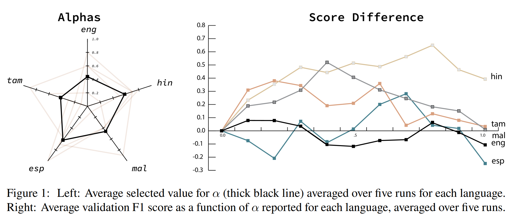

# LanguagePaint

This repository contains the implementation code for paper: <br>
**Patching Language-Specific Homophobia/Transphobia Classifiers with a Multilingual Understanding** <br>
Dean Ninalga <br>
_Proceedings of the Third Workshop on Language Technology for Equality, Diversity and Inclusion_ <br>
as part of _The 14th International Conference on Recent Advances in Natural Language Processing (RANLP), 2023_ <br> <br>
[[Paper](https://aclanthology.org/2023.ltedi-1.28.pdf)] [[Website](https://aclanthology.org/events/ranlp-2023/)] 

`1st place` in three of the five languages in **Task A** in the **Second Shared Task on Homophobia and Transphobia Detection in Social Media Comments** <br>
[[Overview Paper](https://aclanthology.org/2023.ltedi-1.6.pdf)] [[Dataset Paper](https://www.sciencedirect.com/science/article/pii/S2667096822000623)] [[Website](https://codalab.lisn.upsaclay.fr/competitions/11077#learn_the_details-overview)]

If you find this idea useful, please consider citing:
```bib
@inproceedings{ninalga-2023-cordyceps,
    title = "Cordyceps@{LT}-{EDI}: Patching Language-Specific Homophobia/Transphobia Classifiers with a Multilingual Understanding",
    author = "Ninalga, Dean",
    editor = "Chakravarthi, Bharathi R.  and
      Bharathi, B.  and
      Griffith, Joephine  and
      Bali, Kalika  and
      Buitelaar, Paul",
    booktitle = "Proceedings of the Third Workshop on Language Technology for Equality, Diversity and Inclusion",
    month = sep,
    year = "2023",
    address = "Varna, Bulgaria",
    publisher = "Recent Advances in Natural Language Processing",
    url = "https://aclanthology.org/2023.ltedi-1.28",
    pages = "185--191",
}
```
## Overview
At its core, `LanguagePaint` performs a linear interpolation between the weights of a language model trained on multilingual data and the weights of a model trained on a specific language.
The interpolation parameter is determined using grid search on a validation set.


## Getting Started
### Dataset
The shared task dataset is spread across several drive files found on the official page found [here](https://codalab.lisn.upsaclay.fr/competitions/11077#participate).
We provide a simple script that downloads the entire dataset and unifies the formatting.
```bash
cd src
python download.py
```
### Key Requirements
- CUDA 11.8 compatible GPU
- PyTorch >= 2.1.0
- Sentencepiece >= 0.1.99
- Transformers >= 4.35.1
transformers[torch]
datasets
evaluate
```bash
cd language-paint
pip install -q -r requirements.txt
```
For more details on installing CUDA via conda, refer to the [CUDA Installation Guide by NVIDIA](https://docs.nvidia.com/cuda/cuda-installation-guide-linux/index.html#conda-installation).

## Code Overview
#### Main Files
- [`train_mul.py`](train_mul.py): train model using all the training data
- [`train_las.py`](train_las.py): finetune model using language specific data
- [`run_awe.py`](gen_pseudolabels.py): run automatic weight space ensembling

#### Main Arguments
- `--model_name`: name of backbone huggingface model (e.g. 'bert-base-uncased', 'roberta-base', etc.)

## Getting Started
### Download the dataset
The Homophobia/Transphobia detection shared task dataset is split across many drives which can be accessed from the [official page](https://codalab.lisn.upsaclay.fr/competitions/11077#participate) as described in [this paper](https://aclanthology.org/2023.ltedi-1.6.pdf). <br>
Here, we provide a script to automatically download and preprocess the dataset:
```commandline
python src/download.py
```
### Finetuning
Train [Bernice](https://aclanthology.org/2022.emnlp-main.415/) on the entire training split of the shared task dataset
```commandline
python src/train_mul.py --model-name "jhu-clsp/bernice"
```
Train a new unique model on each language
```commandline
python src/train_las.py --model-name "jhu-clsp/bernice" --trained-mul-model None
```
### Automatic Weight Space Ensembling
First train a multilingual model
```commandline
python src/train_mul.py 
```
Train a new unique model on each language, initialized with the weights of the multilingual model
```commandline
python src/train_las.py 
```
Run awe to perform weight interpolation between the multilingual and the language-specific models
```commandline
python src/run_awe.py
```
# Acknowledgements
- This code is partly based on the open-source implementations from the following sources: [imbalanced-semi-self](https://github.com/YyzHarry/imbalanced-semi-self), [S-LoRA](https://github.com/S-LoRA/S-LoRA/blob/main/README.md)
- The model [jhu-clsp/bernice](https://huggingface.co/jhu-clsp/bernice) yielded the best results using LanguagePaint. Check out the [paper](https://aclanthology.org/2022.emnlp-main.415/)
